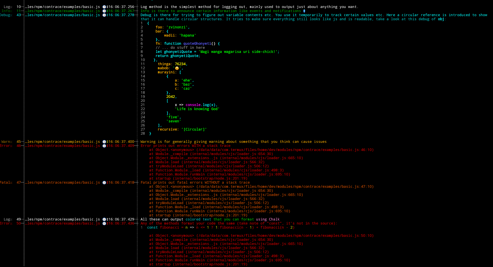

# Contrace

Console Trace is a console package that prints out beautiful IDE-like code and nicely formatted logging. In addition it tells you info about where each log occured and in which file.

It's often difficult to come up with the source of a log and remember removing or silencing logs. Contrace simplifies this by printing out the source line and file from where the log occured.
This is also useful when debugging and making sense of modules you didn't write yourself. You can insert memorable log messages that help you to see how the code is executing, from where and when.

I initially wrote this for use with [Sails](https://npmjs.com/package/sails) but it can be used with any package.

## Installation

```sh
npm install contrace
```

## Usage

This is an extract of the basic example file in the examples:

```js
const chalk = require('chalk');

const contrace = require('..')({
  showLogType: true,
  showTimestamp: true,
});

// contrace.debug(contrace);

contrace.log('Log method is the simplest method for logging out, mainly used to output just about anything you want.');
contrace.info('Info is there to announce certain information like events and notifications \u2139');
const obj = {
  foo: 'zvinonzi',
  bar: {
    wadii: 'hapana',
  },

  fn: function quoteGhonyeti () {
    // ... do stuff in here
    let ghonyetiQuote = 'Magi wanga wagarisa uri side-chick!';
    return ghonyetiQuote;
  },

  thinga: 76234,
  mabob: '\u{1f604}',

  murayini: [
    {
      a: 'ehe',
      b: 'baz',
      c: 'caz',
    },
    2042,
    [
      x => console.log(x),
      "Life is knowing God",
    ],
    "five",
    'seven',
  ],
};
// add a circular reference to the object to show support for circular structures
obj.recursive = obj;

contrace.debug(chalk`Debug is there for trying to figure out variable contents etc. You use it temporarily to track certain values etc. Here a circular reference is introduced to show that it can handle circular structures. It tries to make sure everything still looks like js and is readable, take a look at this debug of {bold obj}:`, obj);

contrace.warn('Warning is for generally giving warning about something that you think can cause issues');
contrace.error('Error prints out errors WITH a stack trace');
contrace.fatal('Fatal prints out fatal errors WITHOUT a stack trace');

contrace.log(chalk`All these can output {cyan colored text} {green that you can format} {keyword('hotpink') using Chalk}`);
contrace.error('Any of the methods format your code the same (take note of "const", it\'s not in the source): ', fibonacci = n => n <= 1 ? 1:fibonacci(n - 1) + fibonacci(n - 2) );
```

After you require the package into your module, you use it like console. The above example outputs:



Sweet!

## Use with SailsJS
Contrace was developed for use with SailsJS but you can use it with any app as detailed above.
For use with Sails there is a hook for it; [sails-hook-contrace](https://npmjs.com/package/sails-hook-contrace)

or you can do the following yourself in your SailsJS app's `config/log.js` file:

```js
module.exports.log = {
  custom: require('contrace')({
    stackIndex: 1,
    methods: [ 'silly', 'verbose', 'info', 'debug', 'warn', 'error' ],
    showTimestamp: true,
    // ... other Contrace options
  }),
  inspect: false,
}
```
Sails will use Contrace as the default log. The above code is what the Contrace hook does for you.

## Options

You pass in options as a dictionary to the initialization function ie:

`const contra = require('contrace')({ /* options */ });`

>- showFile {boolean}: show the file path where the log occured. Default: true
>- showMethod {boolean}: show the method where the log occured. Default: false
>- showTimestamp {boolean}: show timestamp when the log occured. Default: false
>- divider {boolean}: use divs to divide log entries. Default: false
>- stackIndex {number}: set the stack index for file info
[wip] more options documentations

## Author

Emmanuel Mahuni

## Attributions

[Tracer](https://www.npmjs.com/package/tracer) A powerful and customizable logging library for node.js.

[Chroma-fi](https://www.npmjs.com/package/chromafi) cli syntax highlighting: any function - any object - 176 languages

## Github

https://github.com/emahuni

## License

Emmanuel Mahuni (c) 2018 MIT

---
